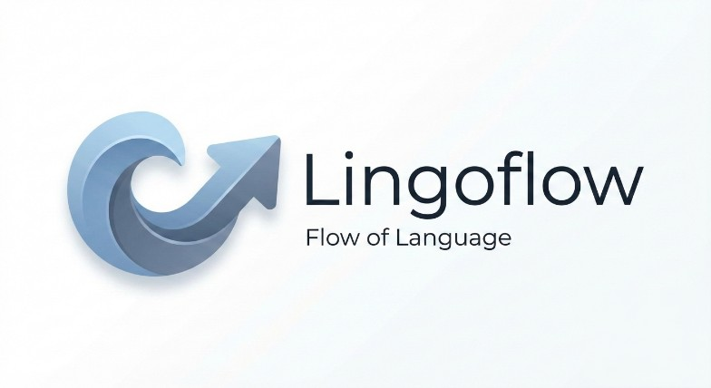

<p align="center">
  
</p>

<h1 align="center">🌊 lingoflow.</h1>

<p align="center">
  <b>experience the next level of translation with a premium, minimalist, and snappy interface.</b>
</p>

<div align="center">

[](https://github.com/AryaXzell/lingoflow/stargazers)
[](https://github.com/AryaXzell/lingoflow/network/members)
[](./LICENSE)
[](https://github.com/AryaXzell/lingoflow/issues)

</div>

---

### 📖 overview
**lingoflow** bukan cuma translator biasa. ini adalah *premium translation tool* yang dirancang buat lu yang bosen sama tampilan translator kaku. dibangun dengan fokus pada kecepatan *realtime* dan *UI/UX* yang sangat *clean*.

### 🛠️ built with
<p align="center">
  <a href="https://skillicons.dev">
    
  </a>
</p>

---

### 🚀 features & highlights

| fitur | penjelasan | status |
| :--- | :--- | :--- |
| **⚡ Realtime Engine** | nerjemahin otomatis pas lu lagi ngetik (debounced) | `deployment-ready` |
| **📝 Markdown Render** | hasil translasi support formatting (bold, italic, list) | `active` |
| **↕️ Auto-Resize** | area input yang fleksibel ngikutin panjang teks lu | `optimized` |
| **🔄 Smart Swap** | tukar bahasa sumber & tujuan dalam sekali klik | `integrated` |
| **🎨 Modern Modal** | pemilihan 30+ bahasa dengan interface yang *smooth* | `polished` |
| **🛑 Abort Controller** | sistem pinter yang nge-cancel request lama biar nggak lag | `stable` |

---

### ⚙️ technical workflow
lingoflow dirancang biar nggak boros *resource* dan tetep *snappy*:

* **input tracking**: memantau setiap ketikan user secara aktif tanpa interupsi.
* **debouncing (350ms)**: nunggu lu jeda ngetik bentar baru kirim request buat hemat kuota api.
* **abort signal**: kalau lu ngetik lagi pas proses *loading*, request sebelumnya langsung dibatalkan otomatis.
* **markdown parsing**: hasil dari backend dirapiin tampilannya pake `marked.js` biar outputnya nggak ngebosenin.

---

### 💻 setup lokal

1.  **clone repository**
    ```bash
    git clone https://github.com/AryaXzell/lingoflow.git
    ```
2.  **masuk ke direktori**
    ```bash
    cd lingoflow
    ```
3.  **jalankan project**
    cukup buka `index.html` di browser kesayangan lu atau pake *live server*.

---

### 🤝 contributing
kontribusi lu sangat dihargai! kalau punya ide fitur baru atau nemu bug:

1.  **fork** project ini.
2.  bikin **branch** baru (`git checkout -b feature/AmazingFeature`).
3.  **commit** perubahan lu (`git commit -m 'add some amazing feature'`).
4.  **push** ke branch (`git push origin feature/AmazingFeature`).
5.  open a **pull request**.

---

<p align="center">
  
  <br>
  developed by <b><a href="https://github.com/AryaXzell">AryaXzell</a></b>
</p>
